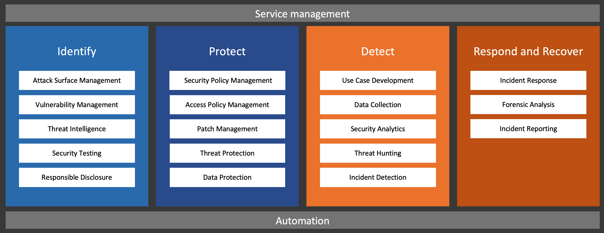

# Security operations standard model

The model describes capabilities that build a complete SecOps service for an organization. 

The capabilities are aligned with NIST Cybersecurity Framework functions. This is a relatively loose alignment, the main reasoning for using CSF here is to make the everything easier to group and visualize.

# 0. Supporting functions

To-do

# 1. Identification capabilities

## 1.1. Attack surface management

Goal: 
* Understand your assets and create a continuously updating visibility to all high-risk systems

MVP:
* Start with assets available to the public or to partners. 
* Document your assets: domains, IP addresses, service addresses.
* Document your attack vectors: internet-connections, DMZs, partner site-to-site connections, VPNs.
* Start monitoring: scan for new or changed assets, scan for open ports and services, scan for vulnerabilities.

Next steps:
* Evaluate commercial attack surface management services if you want. 

## 1.2. Vulnerability management

Goal:
* Identify and fix vulnerabilities in your assets. 

MVP:
* Sign-in for vulnerability bulletins relevant to your assets and systems.
* Build some technical reporting capability for vulnerabilities, either from an assessment or scanning tool or at minimum based on patch-level reporting.
* Ensure your vulnerability reporting cover your critical applications, infrastructure systems and end-user environment.
* Focusing on internet-visible assets is not enough, as internal systems may also be vulnerable via several vectors such as e-mail.
* If you have a formal change management process, ensure it enables you to do quick vulnerability fixing (via emergency changes, standard changes or other method).

Next steps:
* Evaluate commercial vulnerability assessment tools.

## 1.3. Threat intelligence

Goal:
* Have the capability to recieve threat indicators and find out if you are affected.

MVP:
* Understand which of your existing security tools contain external indicators for threats, such as IPS.
* Know how to create custom indicators in your security toolkit, in case you one day need to do this. 

Next steps:
* Evaluate if you would benefit from an automated threat intelligence platform. 

## 1.4. Testing

## 1.5. Disclosure

# 2. Protection capabilities

## 2.1. Security policy management

Goal: 
* Create and manage security policies that define guardrails for your entire IT environment.

MVP:
* Identity risk policies, including conditional access.
* Infrastructure platform resource allowlisting and denylisting.
* Network firewall policies, UTM policies, ACLs.

Next steps:
* Application allowlisting and denylisting for workstations and servers.

## 2.2 Patch management

## 2.3 Threat protection

## 2.4 Data classification

To be or not to be? Maybe this can be removed from this model. 

# 3. Detection capabilities

## 3.1. Use case development
## 3.1. Data collection
## 3.1. Security analytics
## 3.1. Threat hunting
## 3.1. Incident detection

# 4. Response capabilities

## 4.1. Incident response
## 4.2. Forensic analysis 
## 4.3. Incident reporting

# Licensing

Attribution-NoDerivs CC BY-ND

This license lets others reuse the work for any purpose, including commercially; however, it cannot be shared with others in adapted form, and credit must be provided to me.

https://creativecommons.org/licenses/by-nd/4.0/
