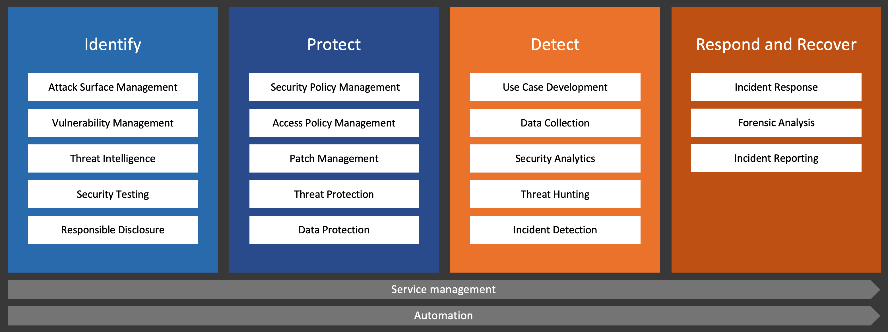

# Security operations standard model

The model describes capabilities that build a complete SecOps service for an organization. 

The capabilities are aligned with NIST Cybersecurity Framework functions. This is a relatively loose alignment, the main reasoning for using CSF here is to make the capabilities easier to group and visualize.

# Identification capabilities

# Protection capabilities

## Security policy management

Goals: create security policies that define guardrails for your entire IT environment:
* Identity risk policies, including conditional access
* Application allow- and denylisting
* Platform resource type allow- and denylisting
* Network firewall policies, UTM policies, ACLs

# Detection capabilities

# Response capabilities

# Licensing

Attribution-NoDerivs CC BY-ND

This license lets others reuse the work for any purpose, including commercially; however, it cannot be shared with others in adapted form, and credit must be provided to me.

https://creativecommons.org/licenses/by-nd/4.0/
